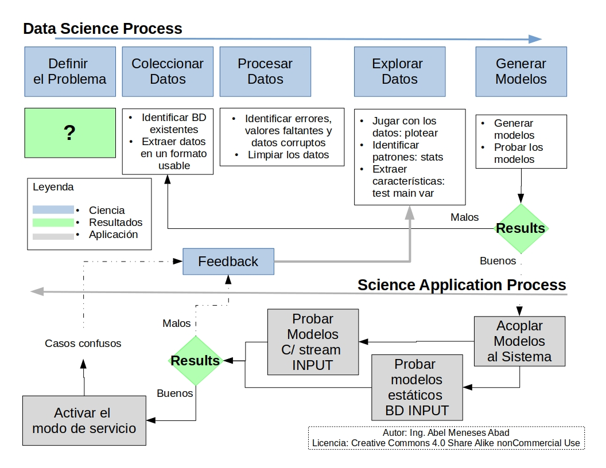
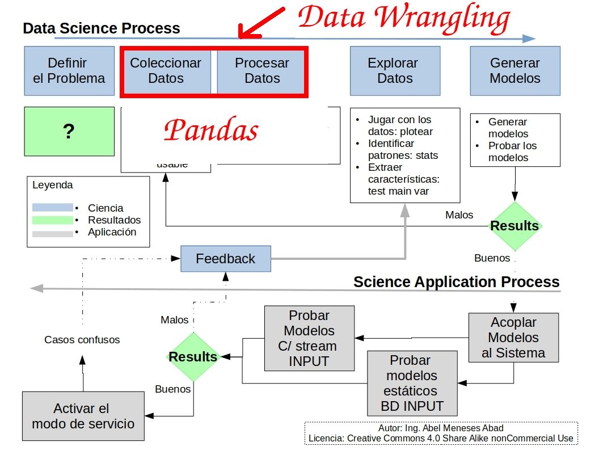
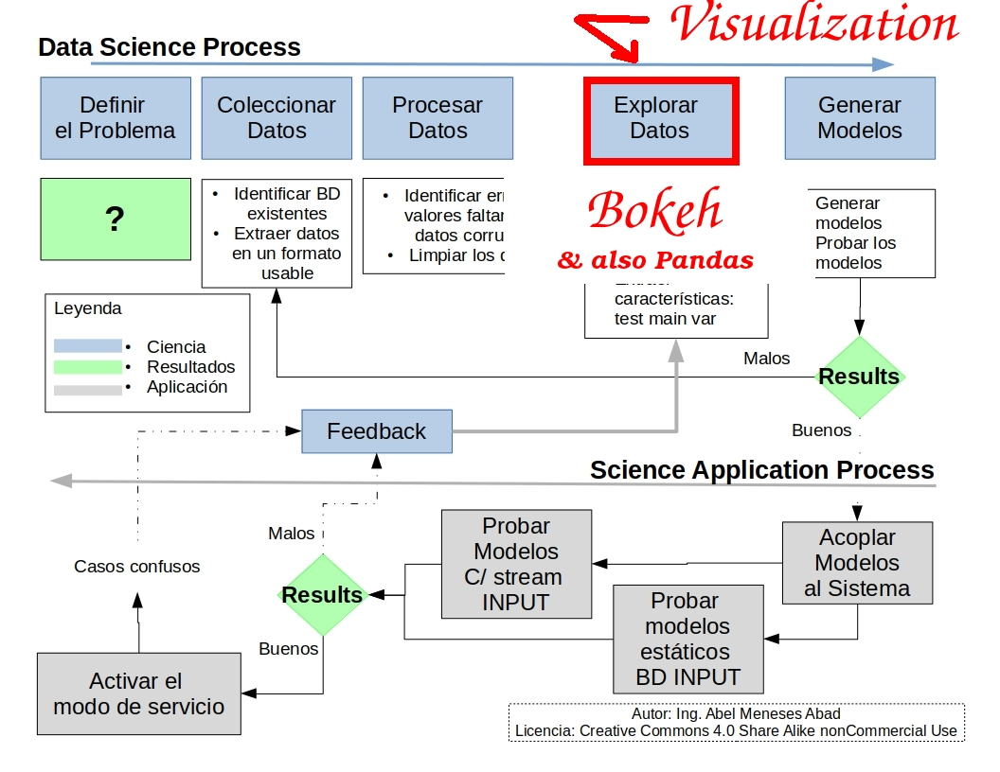

## "Adquirir, Manipular y Visualizar datos con Python: Pandas y Bokeh"

##### [Researcher on Paraphrase Detection on Spanish Text Corpora](http://menesesabad.com/scmc)

###### [Abel Meneses-Abad](https://www.linkedin.com/in/meneses-abad/) / [@abelma1980](https://twitter.com/abelma1980?lang=es)
________________________

##### Slides to Present in [PyDay Cienfuegos](), June 06, 2018

##### Collaborator: [Leonel Salazar](http://debianhlg.cubava.cu/)
________________________

###### Get them: [source code](https://github.com/sorice/pbdata2018)

###### Under [Attribution 4.0 International](http://creativecommons.org/licenses/by/4.0/) License.

---

### About the Speaker

- 2004 BSc on Telecommunications and Electronics
- 2005-09 Research on FLOSS Development & Deployment
- 2006-12 Developing member of several software projects for high education: SistClon, Infodrez, Shakespeare and Sunshine.
- 2009 Chairman of Free Software Committee, Informatica-Habana 2009
- Member of the Cuban Free Software Users Group (GUTL)
- 2009-13 Dir. of Center for Studies of FLOSS for Culture
- From 2012 PhD candidate on Computing Science in the field of NLP

---

## What is all about?

- _python virtualenv_: preparing for real work!
- python-pandas __Acquisition__ & __Munging__ data.
- python-bokeh Data __Visualization__
  - Bokeh in jupyter notebooks
  - Deploying bokeh

---

#### Preparing the OS for python virtualenvs
```bash
$ apt install python3-venv python3-pip
```

#### Creating & activating a the [pbdata]() virtualenv
```bash
$ cd /to/your/projects/repo/
$ python -m venv pbdata
$ source pbdata/bin/activate
(pbdata)$
```
#### _Now you are in the __pbdata__ virtualenv!_

#### Let's the package comes in [offline mode]()

```
(pbdata)$ pip install -i http://<my_IP_address>/pipdir pandas bokeh jupyter...
```

##### [Advice:]() It is a good practice to have every opened project in a root folder.

##### [Advice:]() **python3-pip** is a mature tech to have an offline python packs repo. 
[Reduce your personal/institution Internet consumption]()

--

### About virtualenv in python

> “Virtualenv creates a local environment with its own Python
> distribution installed.”

###### Practical Data Science CookBook (Tattar2017)

#### [Local doc about virtualenv](file:///usr/share/doc/python3.5/html/tutorial/venv.html)

#### [Official & online virtualenvs docs](http://docs.python-guide.org/en/latest/dev/virtualenvs/#virtualenvwrapper)

--

### Virtualenvs Allows

#### to [test new]()/latest python packs [without breaking the operating system]()
#### to [install python packs]() even if you don't have/[whitout root privileges]()
#### to [collaborate effectively]() with others [sharing the piplist]()

---

### What we are doing?



--

### Loading, preprocesing & transforming data!



--

### Playing, knowing, ploting!



---

### Python Pandas

test your previous installation on ipython shell

```python
In [1]: import pandas
```

make something obvious

```python
In [2] from pandas import 
```

--

### About pandas

>“The bibliometrics research area that deal with the study of citations: the relationship between a part/whole cited doc and a part/whole of the citing doc.”

##### Linda C. Smith (1981). *Citation Analysis*. Report at University of Illinois.
##### Morton V. Malin (1968). *The Science Citation Index: A New Concept inen Indexing*. Library Trends 16 (Jan. 1968):376.

--

## Pandas in Action

>“the situation in which pre-existing written material is consciously used again during the creation of a new text or version”
#### Measuring text reuse in the news industry (Clough, 2010)

---

## Python Bokeh

Test bokeh installation with ipython shell

```python
In [1] import bokeh
```

Let's do it a basic example

```python

```

--

### About Bokeh
...

--

### Bokeh in Action

...

---

## Results

---

## Conclusions
